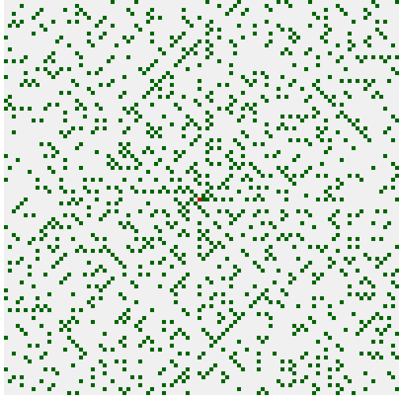

# PrimeSpiral

A sample output of 10000 steps taken:

The red dot in the center is the starting point, and the green dots represent prime numbers.

It starts going 1 step to the right and wraps around anticlockwise. (scaled up 5x)

